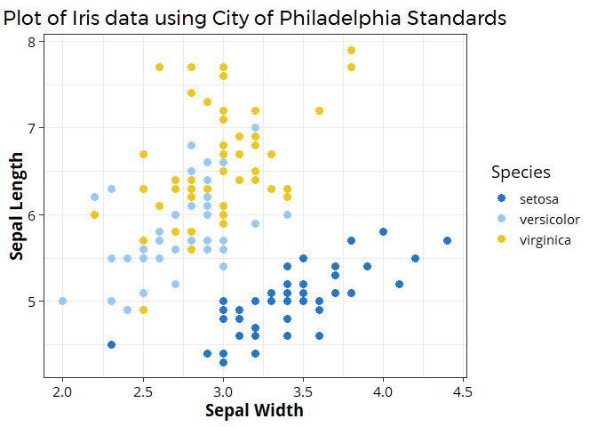

<!-- README.md is generated from README.Rmd. Please edit that file -->

# rphl

<!-- badges: start -->

<!-- badges: end -->

The `rphl` package contains R code for quickly creating figures using
the City of Philadelphia’s [visual
standards](https://standards.phila.gov/guidelines/design-development/brand-elements/),
including the color palette and typography.

## Installation

You can install the development version from
[GitHub](https://github.com/) with:

``` r
# install.packages("devtools")
devtools::install_github("CityOfPhiladelphia/rphl")
```

In order to use the package, you will have to install [Open
Sans](https://fonts.google.com/specimen/Open+Sans) and
[Montserrat](https://fonts.google.com/specimen/Montserrat) on your
computer, and use the `extrafont` package to load the fonts into R:

``` r
# extrafont should install with rphl. If not, install from CRAN:
# install.packages("extrafont")
extrafont::font_import()
```

## Example

``` r
library(rphl)
#> Loading required package: extrafont
#> Registering fonts with R
library(ggplot2)
#> Registered S3 methods overwritten by 'ggplot2':
#>   method         from 
#>   [.quosures     rlang
#>   c.quosures     rlang
#>   print.quosures rlang
ggplot(iris, aes(Sepal.Width, Sepal.Length, color = Species)) +
  geom_point(size = 3) +
  scale_color_phl() +
  theme_phl(base_size = 14)
```


